# Part 2 - Modelling
# Stats Refresher

## Types of Variables
+ Categorical
    + Nominal (example: Red, Green, Blue)
    + Oridnal (example: Small, Medium, Large)
+ Numerical
    + Discrete (example: 585 people, 2 dogs)
    + Continuous (example: Age, height, temperature)

## Regressions
+ Linear Regression
    + Simple Linear Regression
        + `y = b0 + b1*x1`
        + `y` is dependent variable, `x` is independent variable, `b1` is coefficient, `b0` is constant.
        + Example can be "relationship between Exprience and Salary($)"
        + 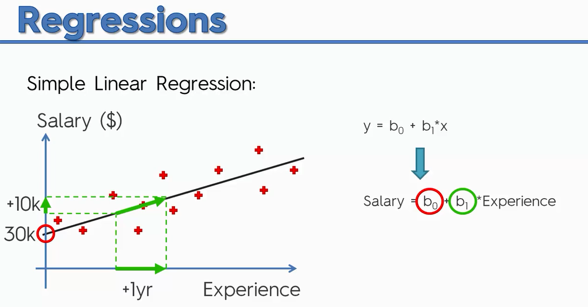
    + Multiple Linear Regression
        + `y = b0 + b1*x1 + b2*x2+ bn*xn`
+ Logisitic Regression
    + Simple Logistic Regression
    + Multiple Logistic Regression

## Ordinary Least Square
+ Simple Linear Regression draws many lines and tries to find the best fit line with Minium value of Sum of squre of difference between Actual Value and Predicted Value (the smallest sum value). This method is called Ordinary Least Square.

+ y - y^ is the difference between Actual Value - Predicted Value.

+ 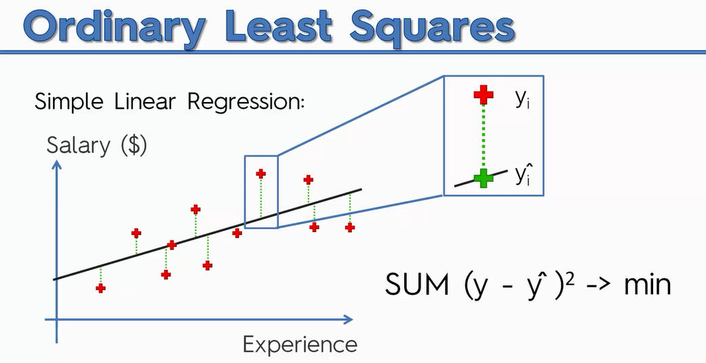

# R Squared
+ **Sum of Square of Residual** : Sum of differences between Acutal values and Predicted values
+ **Total Sum of Square**: Sum of differences between Average line and Actual values
+ `R Squared = 1 - (SSres / SStot)`
+ R Squared value tells us how good is our best fit line compared to Average line.
+ The closer R squared value is to 1, the better our model is.
+ However R squared value can be easily influenced by the number or variables. The more variables we added, the larger R squared value can be. So to avoid this, we need to use Adjusted R-Squared value.
+ 

## Adjusted R-Squared
+ Adjusted R-Squared includes penalization factor. 
+ 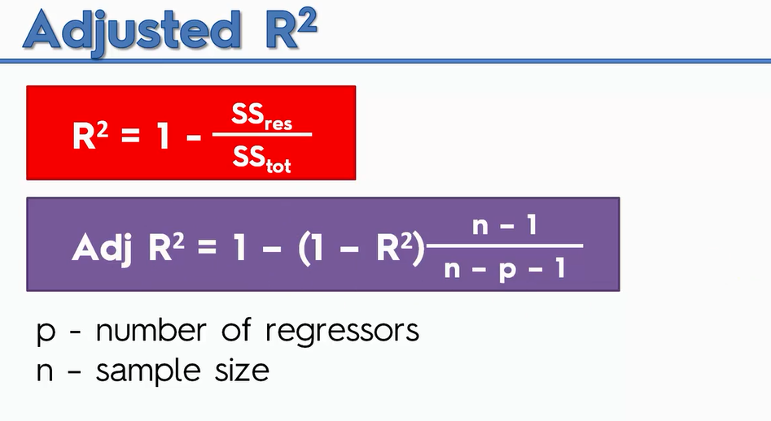

# Using Tool Gretl
+ [gretl](http://gretl.sourceforge.net/)

-----------

# Simple Linear Regression Model
## Goal
+ to find the correlation between Salary and Years of Experience.
## Interpreting Ordinary Least Squares values via Gretl
+ Open File in gretl. Model > Ordinary Least Squares
    + Dependent Variable: Salary, Independent Variable: Year of Experiences
    + Coefficient: 1 unit increase in Year of Experiences will result in 9449.96$ increase in Salary.
    + p-value: tells the statistically significance between the variables. the smaller the p-value, the better. In this case 1.14e-020.
+ Graphs > Fitted, Actual Plots > Fitted Vs Actual
+ Forcasts > 

----

# Multiple Linear Regression

## Assumptions of Linear Regression:
Before we can use Linear Regression, we need to make sure the following assumptions are correct. Only then we should proceed with LR.
1. Linearity
2. Homoscedasticity
3. Multivariate normality
4. Independence of errors
5. Lack of multicollinearity

## Goal
+ to create the model which analyze multiple variables (the related spending, etc) of 50 startups and understand which yields the best profit.
+ csv file includes spending and profit of each startups.

## Dummy Variables
+ As `State` is categorical variable, we need to encode it first.
+ 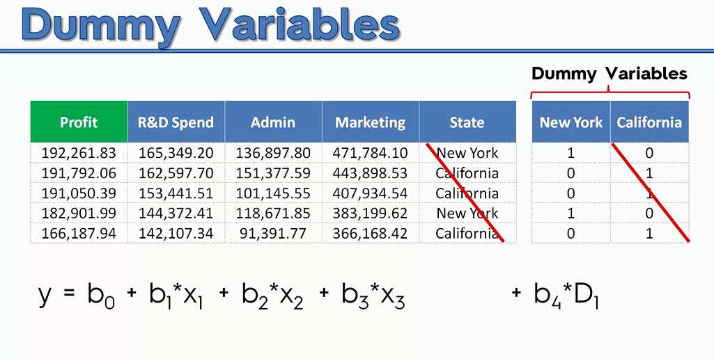
+ make sure not to fall into Dummy Variable trap too. (omit the duplicated column)

# Building A model
As there can multiple features to predict the label, we can't just use all the features. We need to discard some features which are not useful for predictions. There are 2 main reasons.
1. Garbage in , Garbage Out
2. When you have thousands of variables, it is not pratical to explain those to managment level. We might want to keep only important variables.

## 5 Methods of building models:
1. All-in
2. Backward Elimination
3. Forward Selection
4. Bidirectional Elemination
5. Score Comparison

2, 3, 4 are Stepwise Regression.

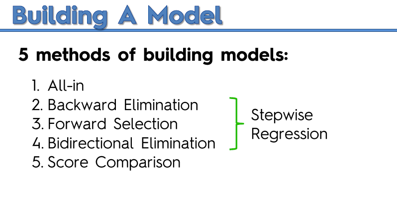
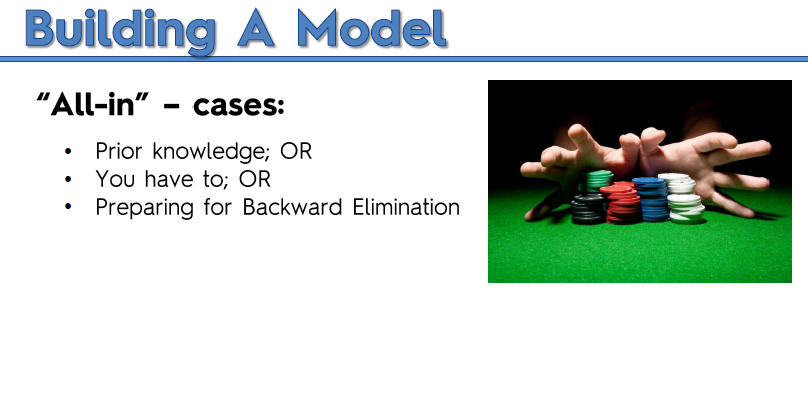
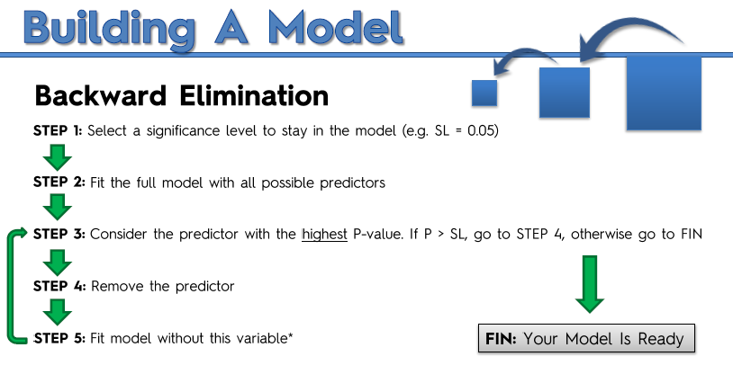
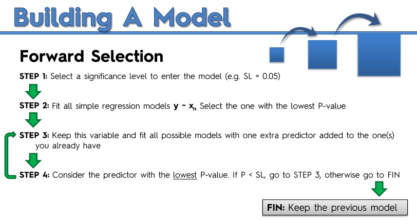
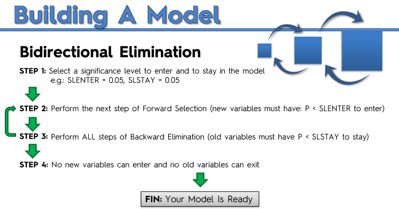
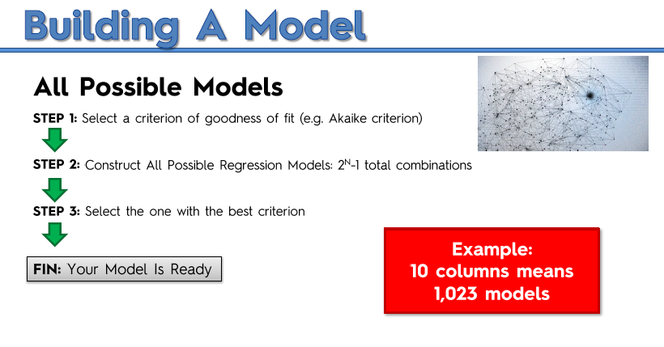

### Pratical Backward Elimination modelling for startup
- P12-50-Startups.csv
- our significance level is 5% (0.05)
    - using backward elimination, we are only left with only one variable `RD Spend`. However before we eliminate `Marketing Spend`, we took a look at graph and we can see there is some kind of relationship going on and also p-value is around 0.05 which is only a bit higher than our defined significance level of 0.05.
        - So how can fix this kind of problem?
        - That's when `Adjusted R-Squared` comes in.
    - If we compare all 4 models `Adjusted R-Squared` values, we can see that 3rd model has the highest value. (with variables: RDSpend and Marketing Spend)
    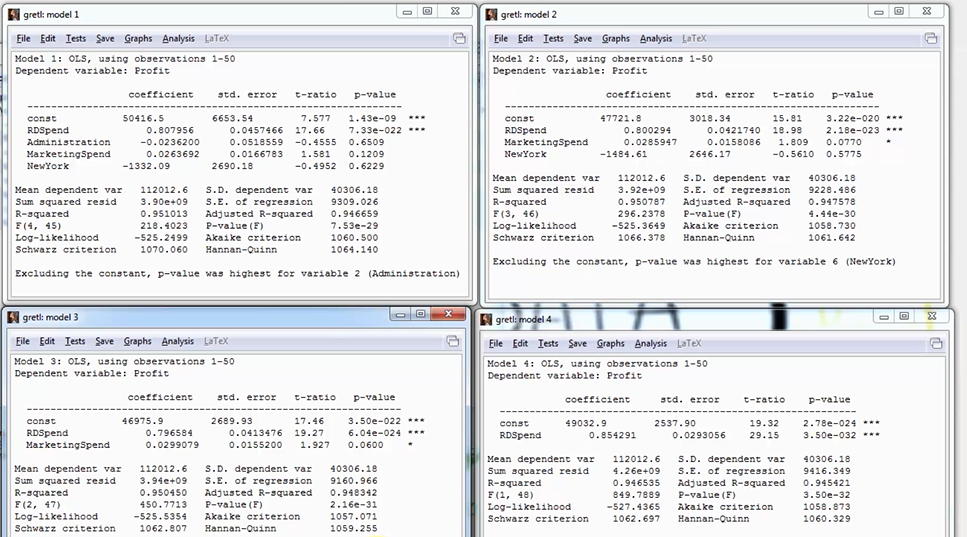
- So we can conclude that 3rd model is the best model.

------

# Logistic Regression

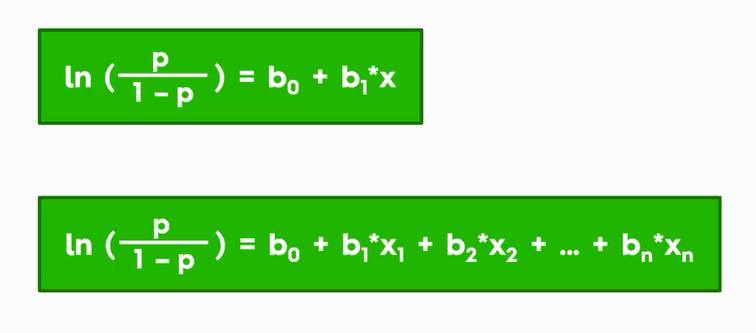

## Goal
- Company has sent out email to customers for promoted item to buy. Email CSV file includes whether customer has clicked via promoted link on email or not.
- We want to predict customers action (take action or not) based on the past information (Age, Gender).

## Logistic Regression Intuition
- for binary classification, we can't really use linear regression for fitting the best fit line. We have to use `Sigmoid` function to separate the classes.
- Let's say we have age of 20, 30, 40 and 50. We can project those points on X axis and project their probabilities of being closer to the class (1, 0) as below. Example: 20 yr old have a very low probability of 0.7% of clicking the promotion where 50 yr old have a very high probability of 99.4%.
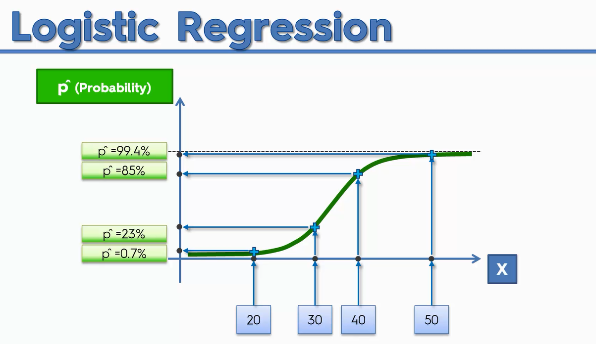
- Using this initution, we can draw a threadshold of 0.5 (`defined by us and can be changed accordingly`) in the middle. Any points below this line are belonged to class 0 (NO) and above line are belonged to class 1 (YES).
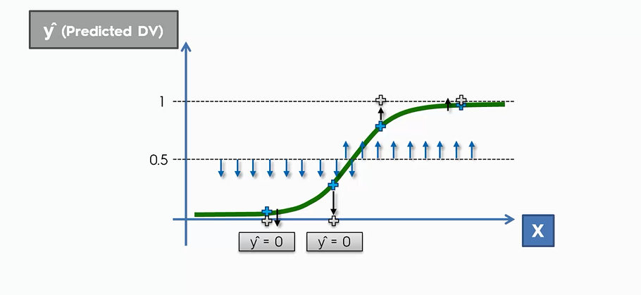

## Model Building
- using Age and Take action data
- => Model > Limited Dependent Variable > Logit
- For graph, => Graphs > Fitted Actual Plot > Against Age
- Do the same thing with Female or Male variable.
- => Analysis > Forecasts > we can see the predictions.

## False Positive and False Negative
- False Positive (Type I error, Actual 0 => Predicted 1)
- Flase Negative (Type II error, Actual 1 => Predicted 0)

## Confusion Matrix
- 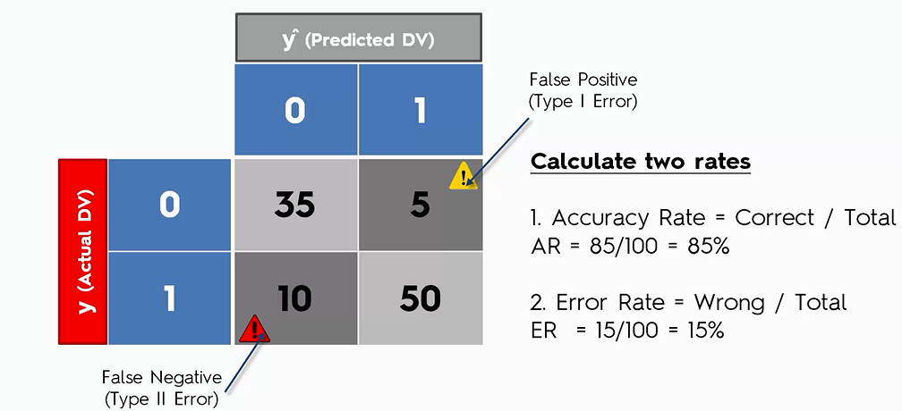

## Logistic Regression Coefficient
- 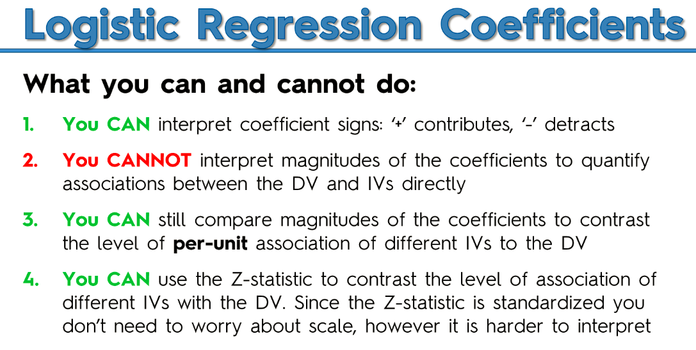
IV - Independent Variable, DV - Dependent Variable

------

# Building a Robust GeoDemographic Segmentation Model

## Goal
- to predict whether the customer will churn (`Existed: 0 / 1`) or not based on the information for a bank. So that the bank can take necessary action on the hightest risk customers to continue using bank's services.
- This can be applicable for similiar scenarios like customer default loan or not, etc.

## GeoDemographic Segmentation
- Segmentating data with similar traits using different groups.

## Transformation Independent Variables
- We can apply multiple transformation to the variables.
    - square root
    - square
    - natural log
- Why we want to use transformation?
    - basically to make change to the variable to make consinstant changes, regardless of large or small value.
    - Example: changes to 1000$ to 1000$ and 10,000$ have a different effect. Second one doesn't really have much noticible changes. Instead if we use nautral log, then changes to both can have consistent effect. 
    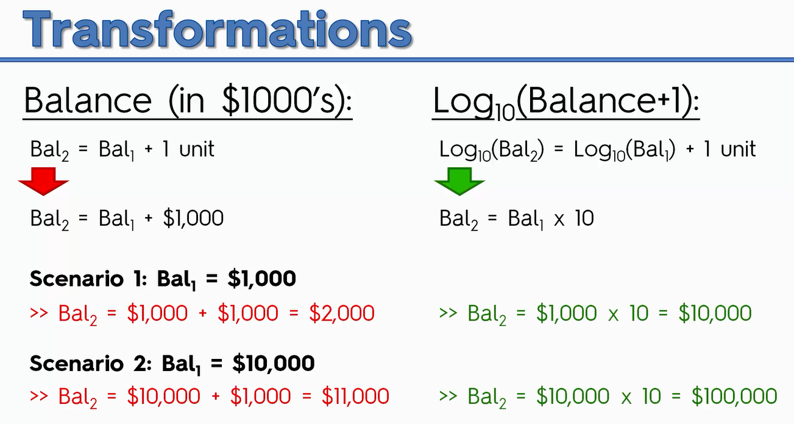

## Derived Variables
- Generally, `Balance` is associated with `Age`, meaning Older people tends to have larger Balance than in their account. However sometimes it is not the case. There are young people who can accumulate wealth and older people who can't accumulate wealth enough even though in their 50s or 60s. So we want to create new effect to separate out those groups. Example: `WealthAccumulation=Balance/Age`

## Multicollinearity
- Multicollinearity refers to a situation in which more than two explanatory variables in a multiple regression model are highly linearly related. 
- Basically you are putting variables which are very similar in nature. Example: putting both `WealthAccumulation` and `Balance` into the model which are very similiar.
- How can we check it in gretl? => After creating the model > Analysis > Collinearity

## Correlation Matrix
- We can check Correlation Matrix in gretl by => View > Correlation Matrix

------

# Accessing Model 
- Let's say we want to contact people who are the most likely to take the promotion that bank offers.
 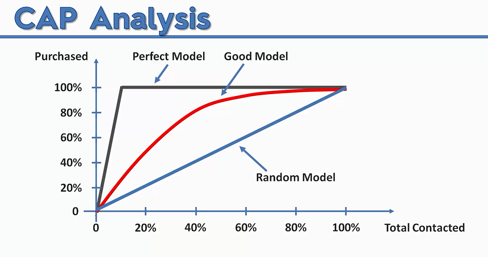

## Cumulative Accuracy Profile (CAP)
- CAP allows you to access model performance.
- Note: CAP doesn't equal to ROC (Reciver Operating Characteristic)

 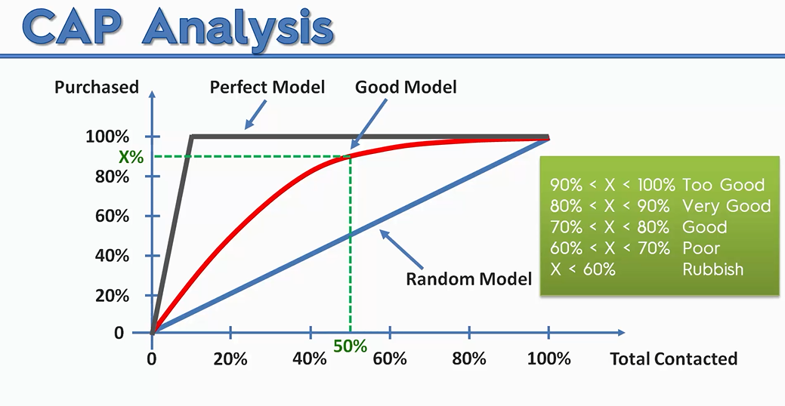

 ------

 # Drawing Insights from the model

- Let's say we have history of customer information who churned(existed) the services. Using this information, we trained and created the model which predicts customer who are likely to churn (exist) the service.
- Out of 1000 customers we cacluated `P-Hat` value which is the model predictions of likelyhood of people existing the services. and we compare against the actual value `Existed`.
- We can draw below CAP. According to model's CAP, we can cover 80% of targeted customers even if we just send promo email to 50% of the customers, sorted by `P-Hat` values decending order (people who has the highest probability of leaving the service). So that customers can stay with the services for longer preriod of time. This is a value added service for the company.

 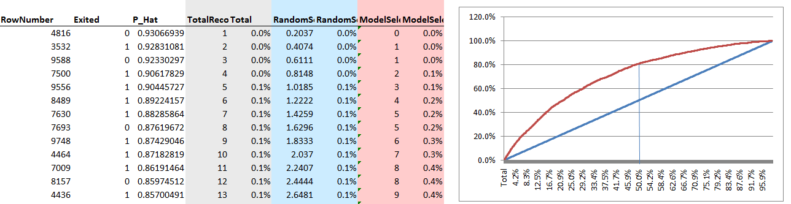
### Benefit 1) Likelihood Score
- This will tell us how likely the customer is going to churn, etc.
### Benefit 2) Budget Constraint
- Let's say the cost of sending email is 1 cent per email. If we can target to the customers who have the highest probability of churning, we can save a lot of money for company, rather than blasting emails to everyone. 

### Benefit 3) Efficiency
- By varying the target % (Whether we want to reach 50% or 80% or customers,etc), this will avoid unnecessary contacting, spamming email to the customers who are unlikly to churn.

### Cut off point:
- As there are many points that we can decide to set the target, we need to check whether there is prominent differences between point A and point B. If the differences between them is not significant, we might want to considering choosing point A. 
- We want to get higher ROI as much as possible.
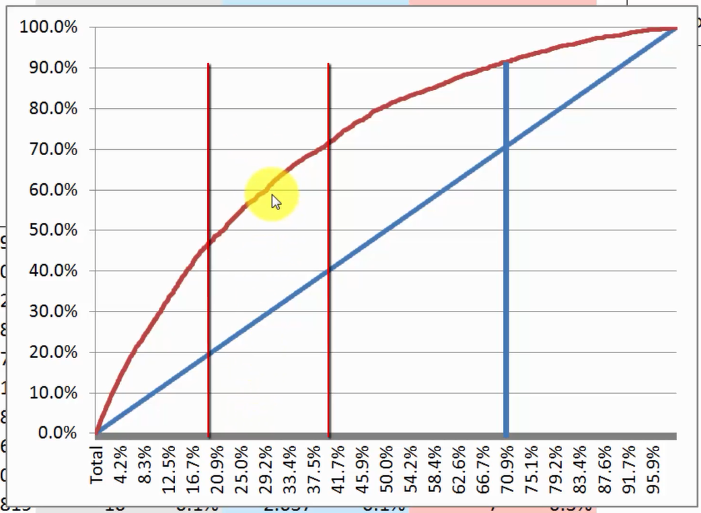

# Odds Ratios
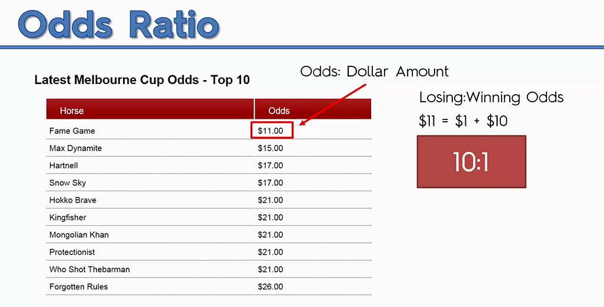
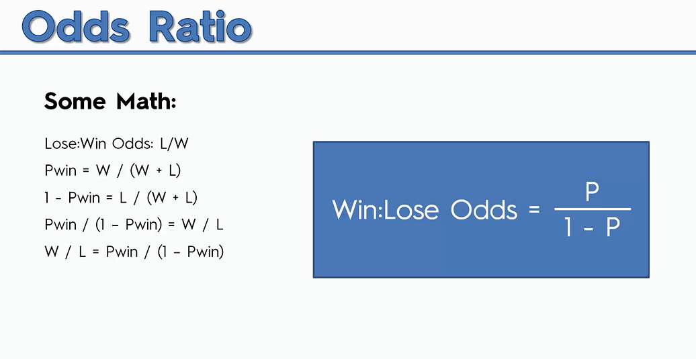
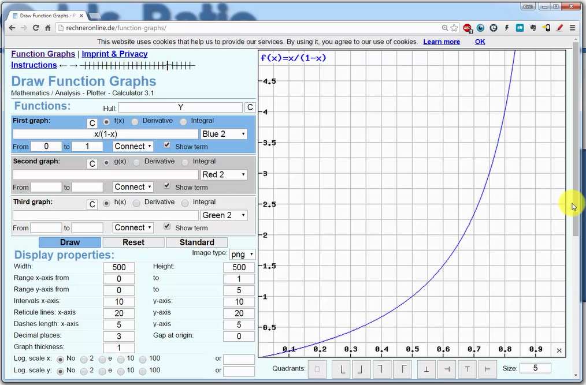

## Odds Ratio vs Coefficients in Logistic Regression
- we can get how much odds increase by using exponent of cofficients of a variable. For example: 1 unit increase for Age will increase the odds of 1.075 for the customer to churn.
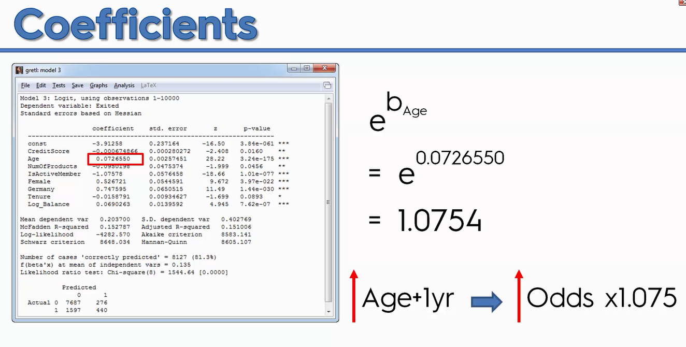

## Deriving Insights from coefficients

- in gretl, create model of Logistic Regression Model.
- => Analysis > Logit odds ratio

------

# Model Maintenance

## Model Deterioration

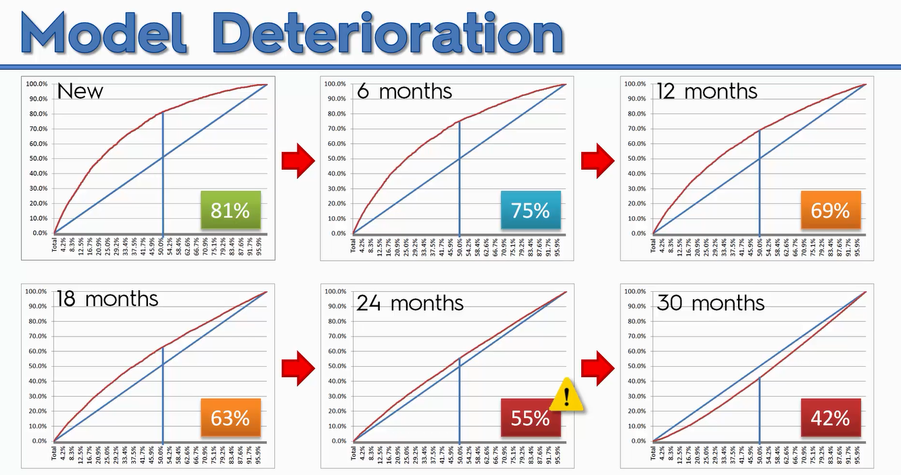

## Why do model deteriorate?
1. Additional Factors (which are added only after model is deployed)
2. Changes in behaviour (such as people start to use mobile banking instead of traditional banking)
3. Changes in Process 
4. Changes in Existing Factors (customers getting older and model doesn't accomodate the new customer based, etc)
5. Competitor
6. Changes in Industry
7. Changes in Regulations
8. Changes in Product
9. Depletion
10. Spontaneous Changes (like customers from France left the services due to boycotting (or) more customers from France join the services as your service the only avaliable one, etc)

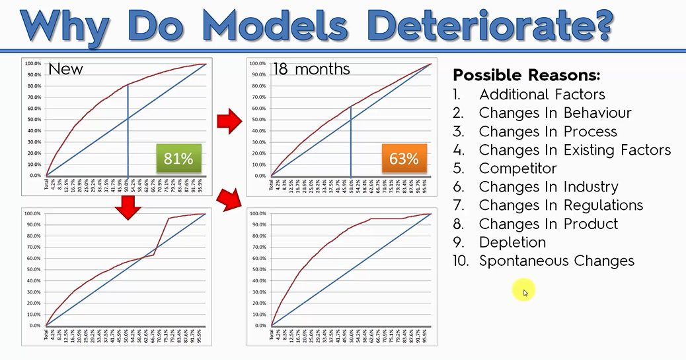

## Three levels of maintenance for deployed models
- Access
- Retrain
- Rebuild

Another way is `Champion Challenger Set up`, where you run the original model and new model side by side. Then compare the performance. Or you can split the population half by half and run the models, etc.

---

# Part 3 - Data Preparation

### Folder Structure
1. Original Data
2. Prepared Data
3. Uploaded Data
4. Analysis
5. Insights
6. Final