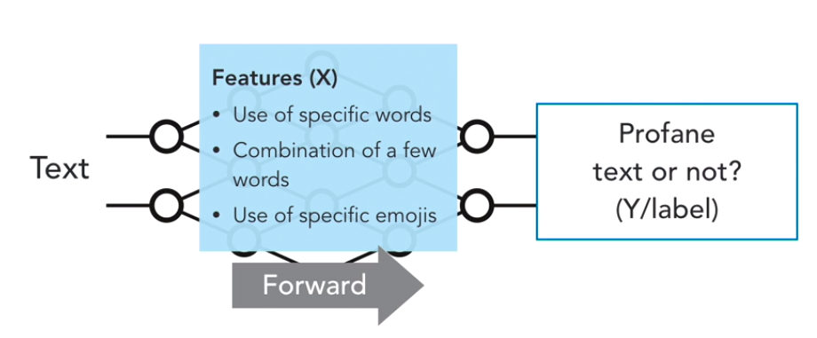

# Why design AI?
- Understand the problem first
- It's the same as building a prototype of an app first.

----

# Design Process
## 1) Start with the problem
- What is the problem we need to solve?
    - Example: spam or not spam / what is this image?
    - Y or label = What is this image?
## 2) Explore the datasets.
- What do we feed our neural network with?
## 3) Neurons and Synapses
- X Factor
    - Each neuron's impact Y
    - Like a brain
    - Neurons are defined by Y or features
- X or Features
    - sender's address, time of day received, words in the subject, words in the email, Email containing specific words
- Model
    - relationship between the labels(Y) and the features(X)
    - bring all together
## 4) Forwards and Backward Propagation
- Forward (CNN)
    - typically used for pattern or Image recognition
- Backward (RNN)
    - not only learn from the input, but also from the results
    - great approach for Speech and Handwriting recognition
    - like google assistant and siri

----

# Designing a Neural Network Applied

### Challenge Step 1:
1. Product review section becoming filled with bad behavior
2. What are the the problem and the labels?

### Challenge Step 2:
- Issues with comments and reivews in products
    - Step 1: Profane text or not (Y label)?
    - Step 2:
        - 1. Define X or features
        - 2. Define if better forward or backward neural network

### Possible solution

